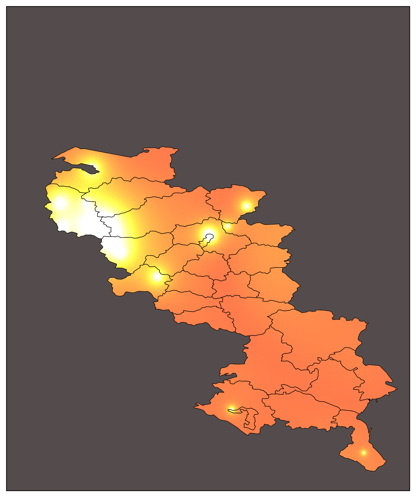

## Установка и запуск
### Установка Git

Скачайте и установите Git с [официального сайта](https://git-scm.com/downloads)

### Клонирование репозитория

```bash
git clone <URL_репозитория>
cd <папка_репозитория>
```

### Альтернатива: скачать архивом
Скачайте репозиторий как ZIP-архив со страницы репозитория и распакуйте.

### Установка uv
Установите uv по [инструкции](https://docs.astral.sh/uv/getting-started/installation/).


### Установка зависимостей и запуск
```bash
uv sync
cd <папка скрипта, который нужен>
uv run main.py
```

## Тайные знания
  